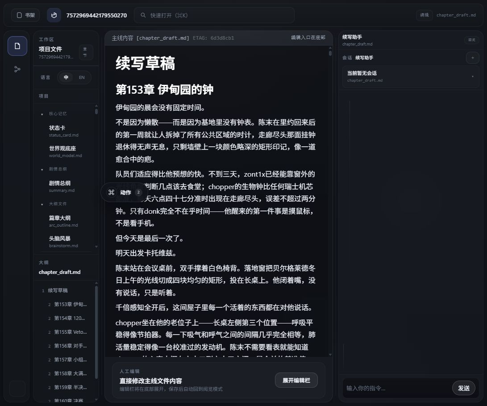
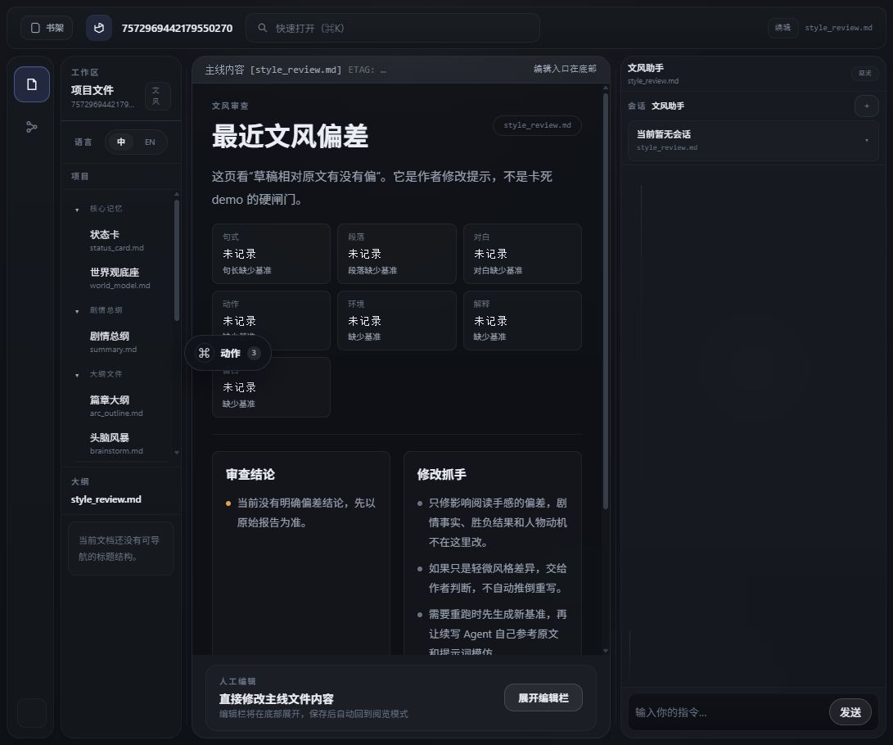
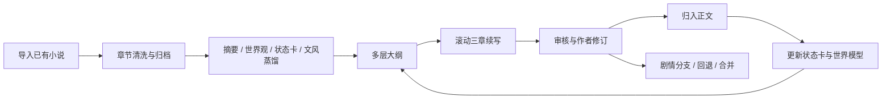
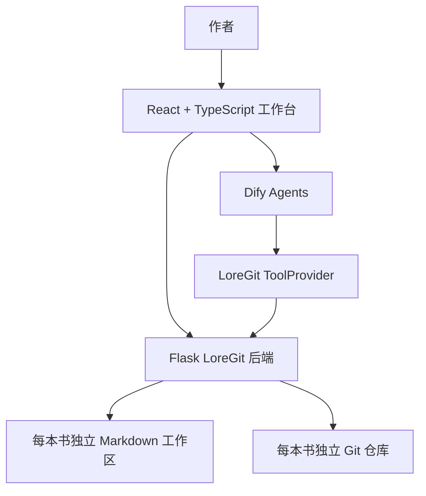

# AI 小说创作工作台

一个面向长篇网文作者的本地 AI 创作工作台：用 Dify Agent 生成，用 Git 管剧情分支，用审查工作台控制失控风险。

它不是一个“让模型凭空写小说”的聊天框，而是一个类似 Cursor 的小说创作 IDE。作者可以把已有小说导入为可维护的章节资料库，再把世界观、状态卡、文风指纹、大纲、章节草稿和审查意见沉淀成可回滚、可比较、可分支实验的创作资产。


## 为什么做这个

网文作者真正害怕的往往不是“AI 文风不够像”，而是两件事：

- 剧情失控：越写越多，人物状态、世界观约束、伏笔债务和章节因果开始打架。
- 灵感枯竭：作者需要可以被修改的抓手，而不是一次性、不可追溯的 prompt 输出。
- 试错成本高：一条剧情线写坏后，很难优雅地回退、分叉、比较和合并。

这个项目把 AI 写作从“对话生成”推进到“资产化创作工作流”：模型负责提出草稿和判断依据，作者保留最终审美和剧情选择权。

## 核心能力

- **小说导入与章节归档**：把已有长篇文本清洗为 `chapters/*.md`，建立每本书独立工作区。
- **创作资产蒸馏**：从原文中提取 `summary.md`、`world_model.md`、`status_card.md`、文风档案和多层大纲。
- **滚动三章生产**：逐章消耗章节大纲，批量进入“续写草稿 → 审查 → 正文化归档”的循环。
- **审查与白盒化**：审核 Agent 聚焦剧情连续性、世界观冲突、状态卡更新和可复用问题沉淀；文风作为建议交还作者。
- **Git-native 剧情分支**：每本书是独立 Git 仓库，支持剧情分支、回退、合并和 diff 审阅。
- **Dify DSL 可复现**：当前 6 个 Agent 工作流已导出到 `dify_workflows/`，可导入 Dify 作为模板。

## 截图导览

### 书库与导入

从书架进入作品，或导入新的小说资料。运行时书库数据不提交进源码仓库。


### 多面板创作 IDE

左侧是项目文件和章节资产，中间是可读写 Markdown 工作区，右侧是 Agent 会话、剧情节点和 Git 工作台。


### 工作台动作面板

初始化、补齐、完整重跑、滚动三章生产等“无提示词后台动作”从独立动作面板触发，不混进聊天记录。


### 章节草稿与续写接棒

续写 Agent 只负责写入 `chapter_draft.md`，通过后再归入正文，并触发状态卡、世界模型和草稿清理接棒。



### 审查证据与作者判断

审查链路把冲突、风险和文风建议整理成作者可读证据。文风不再作为卡死 demo 的硬门，而是给作者可修改的判断依据。



### 剧情分支与回退

作者可以新开剧情试写、切换剧情线、合并分支或只回退当前剧情线，让小说创作具备 Git 式试错能力。


## 工作流



## 系统架构



## Dify Agent

当前仓库包含 6 个净化后的 Dify DSL 快照：

- `dify_workflows/世界模型agent.yml`
- `dify_workflows/文风学习agent.yml`
- `dify_workflows/灵感大纲agent.yml`
- `dify_workflows/续写agent.yml`
- `dify_workflows/审核agent.yml`
- `dify_workflows/读书存档agent.yml`

这些 YAML 可以导入 Dify 复现工作流结构、提示词、节点图和工具引用，但不是完整运行时备份。新环境仍需配置模型供应商、Dify App API Key 和 LoreGit ToolProvider 地址。

## 技术栈

- Frontend: React, TypeScript, Vite
- Backend: Flask, Python
- Agent Orchestration: Dify Workflow / Chatbot Agent
- Storage: Markdown files, local filesystem
- Versioning: nested Git repositories per book
- Runtime: local Windows development stack with Docker / Dify

## 如何部署

本项目当前更适合作为本地 demo 和工程样例运行。推荐先用 Windows 本地 demo pack 跑通，再按需要接入独立 Dify 或容器化部署。

### 最省事的方式：下载 Release 包

在 GitHub Releases 下载 `novel-agent-demo-v*.zip`，解压后执行：

```powershell
.\start_demo.ps1 -InitEnv
```

然后填写 `deploy/demo/.env`，再启动：

```powershell
.\start_demo.ps1
```

Release 包包含源码、Dify DSL YAML、前后端和启动脚本；不包含 Dify 数据库备份、模型密钥、Dify App API Key、私有书库或运行时存储。

### 1. 准备依赖

本地演示需要：

- Windows + PowerShell
- Docker Desktop
- Python 3.11+
- Node.js 20+
- Git
- 一个可访问的 Dify 运行时

### 2. 配置环境变量

复制示例配置，不要把真实 `.env` 提交到仓库。

```powershell
Copy-Item .\deploy\demo\.env.example .\deploy\demo\.env
```

至少需要填写：

- `NOVEL_AGENT_DIFY_COMPOSE_DIR`：本机 Dify compose 目录
- `DIFY_BASE_URL`：Dify Service API 地址，默认 `http://localhost/v1`
- `DIFY_*_API_KEY`：各个 Dify App 的 API Key
- `DEEPSEEK_API_KEY` 或你自己的 OpenAI-compatible 模型供应商 Key

### 3. 导入 Dify 工作流

在 Dify 控制台导入 `dify_workflows/` 下的 YAML：

- `世界模型agent.yml`
- `文风学习agent.yml`
- `灵感大纲agent.yml`
- `续写agent.yml`
- `审核agent.yml`
- `读书存档agent.yml`

导入后需要在 Dify 中重新配置模型供应商、App API Key，并确认 LoreGit ToolProvider 指向本地后端地址。

### 4. 启动本地 demo

```powershell
.\deploy\demo\bootstrap.ps1
```

常用参数：

```powershell
.\deploy\demo\bootstrap.ps1 -InitEnv
.\deploy\demo\bootstrap.ps1 -SkipDify
.\deploy\demo\bootstrap.ps1 -Status
.\deploy\demo\bootstrap.ps1 -Stop
```

启动成功后打开：

```text
http://127.0.0.1:5173/bookshelf.html
```

### 5. 使用 Compose Demo Pack

```powershell
docker compose --env-file deploy\demo\.env.example -f docker-compose.demo.yml up -d --build
docker compose --env-file deploy\demo\.env.example -f docker-compose.demo.yml run --rm smoke
```

Compose 版本默认不携带真实 Dify 数据库和模型密钥，需要显式连接外部 Dify 运行时。

### 6. 验证部署

最小验证路径：

1. 打开书架页面，确认可以进入一本书。
2. 在工作台右下角打开“动作”面板，确认世界观/文风初始化和滚动三章入口可见。
3. 在“配置”入口填写或检查 Dify API Key。
4. 导入或打开一本测试书，确认章节、世界观、文风、大纲和草稿文件能被读取。
5. 运行一次续写或审查动作，确认 Dify 能通过 LoreGit ToolProvider 访问 Flask 后端。

更详细的部署边界、Dify runtime 规则和 smoke check 标准见 `docs/DEPLOYMENT.md`。

### Packages / GHCR 路线

后续可以把 `backend` 和 `frontend` 发布到 GitHub Container Registry，让部署命令变成拉取预构建镜像。即使使用 Packages，仍然需要外部 Dify 运行时、模型供应商 Key、Dify App API Key 和 LoreGit ToolProvider 配置。

当前推荐优先使用 Release ZIP，因为它更透明，也更适合本项目的本地 Dify + 本地书库 demo。

## 目录概览

```text
frontend/              # React 创作工作台
novel_git_server/      # Flask API、书库协议、Dify 工具桥
dify_workflows/        # 当前导出的 Dify 工作流 DSL
deploy/demo/           # 本地 demo 启动与容器化脚本
scripts/               # 本地启动、Dify patch、导出和验证脚本
tools/                 # 辅助维护工具
docs/                  # 演示、架构、部署和收口文档
prd.md                 # 历史 PRD 与产品蓝图
```

运行数据位于 `novel_git_server/storage/`，不会作为源码提交。

## 项目状态

项目处于本地 demo 收口阶段，已经具备前后端工作台、Dify 工具桥、小说导入、世界观/文风/大纲/续写/审核 Agent 主链路，以及剧情分支/回退的核心能力。

推荐阅读：

1. `docs/DEMO_SCRIPT.md`
2. `docs/ARCHITECTURE.md`
3. `docs/DEPLOYMENT.md`
4. `docs/DIFY_PROMPT_INVENTORY.md`
5. `docs/ROLLING_CHAPTER_WORKFLOW_CASE.md`
